# CPR Events for Midi Workflows

This page provides information on the sequence of events triggered for MidiQOL workflows. Each event will fetch and run associated embedded macros from items, active effects, templates or regions. Events use the following prefixes to identify the context of their trigger:

- `target` includes events triggered for the target(s) of the item
- `scene` includes events triggered for all tokens on the scene, useful for third party reactions
- *No Prefix* - events triggered for the actor rolling the item

These other categories may have their events triggered at several points within a workflow if the conditions are met:

- `D20` events are triggered when any d20 is rolled by an actor for any reason
  - These events trigger from dice commands in chat only when a token is selected
  - D20 rolls in scripts will trigger these events only if an actor uuid is provided: `new Roll('1d20', {actorUuid: "uuid here"}).evaluate()` or `new Roll('1d20', actor.getRollData()).evaluate()`
- `Bonus` events are triggered for any save, check, skill, or tool roll

There are many more events available beyond the ones shown here. A full list including descriptions and requirements is available in the [CPR Discord](https://discord.com/channels/1089258451949064296/1280057767947665440).

> *In MidiQOL versions 13.0.23+, saves can be rolled before damage with this setting enabled: `MidiQOL > Workflow Settings > Misc > Roll saves before damage`. This flowchart documents the default setting, damage rolled before saves.*

## Priority

Embedded macros are generally called in ascending priority order for each event. Macros associated with the "Apply Damage" events are the only exception: `applyDamage`, `targetApplyDamage`, and `sceneApplyDamage`. These are lumped together before being sorted by priority, so the order of `Use` -> `Target` -> `Scene` will vary depending on how your macros are configured. The "Apply Damage" events are represented with one node in the chart.

## MidiQOL Hooks

Embedded macros are triggered by MidiQOL hooks. As of MidiQOL v13.0.48, these hooks fire in the following order relative to MidiQOL OnUse Macros:

| Hook | Embedded Macro Order | CPR Event |
| ---- | :--: | ---- |
| `midi-qol.preTargeting` | First | `preTargeting` |
| `midi-qol.premades.postNoAction` | Last | `preItemRoll` |
| `midi-qol.premades.postPreambleComplete` | Last | `preambleComplete` |
| `midi-qol.preAttackRollConfig` | First | `preAttackRollConfig` |
| `midi-qol.premades.postWaitForAttackRoll` | Last | `postAttackRoll` |
| `midi-qol.premades.postAttackRollComplete` | Last | `attackRollComplete` |
| `midi-qol.premades.preDamageRollComplete` | Last | `damageRollComplete` |
| `midi-qol.premades.preUtilityRollComplete` | Last | `utilityRollComplete` |
| `midi-qol.premades.postSavesComplete` | Last | `savesComplete` |
| `midi-qol.preTargetDamageApplication` | Last | `applyDamage` |
| `midi-qol.premades.postRollFinished` | Last | `rollFinished` |

## Chart

```mermaid
---
config:
  themeVariables:
    fontSize: '20px'
---

flowchart TD
  subgraph use[" "]
    preTargeting
    preItemRoll
    preambleComplete
    utilityRollComplete
    preAttackRollConfig
    postAttackRoll
    attackRollComplete 
    damageRollComplete
    savesComplete
    applyDamage
    rollFinished
    onHit
    targetPreItemRoll
    targetPreambleComplete
    targetUtilityRollComplete
    targetPreAttackRollConfig
    targetPostAttackRoll
    afterAttackRoll["<p style='width:200px; height:30px; text-wrap:balance;'><b>After Macros</b>
      <small><li>Heroic Inspiration Attack</li></small><p>"]:::edgeLabel
    targetAttackRollComplete
    targetDamageRollComplete
    targetSavesComplete
    targetRollFinished
    scenePreambleComplete
    afterScenePreamble["<p style='width:200px; height:30px; text-wrap:balance;'><b>After Macros</b>
      <small><li>Condition Resistance Checked</li>
      <li>Condition Vulnerability Checked</li></small></p>"]:::edgeLabel
    sceneUtilityRollComplete
    scenePreAttackRollConfig
    afterSceneAttackConfig["<p style='width:200px; height:30px; text-wrap:balance;'><b>After Macros</b>
    <small><li>Template Visibility Checked</li></small></p>"]:::edgeLabel
    scenePostAttackRoll
    sceneAttackRollComplete
    crit["<p style='width:200px; height:30px; text-wrap:balance;'><b>After Macros</b>
      <small><li>Crit/Fumble Homebrew</li></small></p>"]:::edgeLabel
    sceneDamageRollComplete
    afterSceneDamage["<p style='width:200px; height:30px; text-wrap:balance;'><b>After Macros</b>
      <small><li style="height:20px;">Heroic Inspiration Damage</li>
      <li style="height:20px;">Dice So Nice Shown</li>
      <li style="height:20px;">Exploding Heals</li>
      <li style="height:20px;">Manual Rolls</li></small></p>"]:::edgeLabel
    sceneRollFinished
    afterSceneRoll["<p style='width:200px; height:30px; text-wrap:balance;'><b>After Macros</b>
      <small><li style="height:20px;">Condition Resistance Cleanup</li>
      <li style="height:20px;">Condition Vulnerability Cleanup</li>
      <li style="height:20px;">Mastery Automations</li>
      <li style="height:20px;">Expire CPR Special Durations</li>
      <li style="height:20px;">Delete Workflow Effects</li>
      <li style="height:20px;">DMG Cleave</li></small></p>"]:::edgeLabel
  end

  subgraph d20["D20 Rolls"]
    direction TB
    preEvaluation --> 
    scenePreEvaluation --> 
    postEvaluation --> 
    scenePostEvaluation
  end

  subgraph bonuses["Bonus"]
    situational -- Has Target --> targetSituational
    situational -- No Target --> sceneSituational
    targetSituational --> sceneSituational
    sceneSituational -->
    context -->
      preEvaluation
      scenePostEvaluation --> 
    bonus --> 
    sceneBonus -->
    post
  end

  preTargeting --> preItemRoll
  preItemRoll --> targetPreItemRoll
  targetPreItemRoll --> preambleComplete
  preambleComplete --> targetPreambleComplete
  targetPreambleComplete --> scenePreambleComplete
  scenePreambleComplete -.-> afterScenePreamble
    %% invis link for layout
    targetPreambleComplete ~~~ utilityRollComplete
    scenePreambleComplete -- Has Utility --> utilityRollComplete
    utilityRollComplete --> targetUtilityRollComplete
    targetUtilityRollComplete --> sceneUtilityRollComplete
    sceneUtilityRollComplete --> savesComplete

    scenePreambleComplete -- Has Attack --> preAttackRollConfig
    preAttackRollConfig --> targetPreAttackRollConfig
    targetPreAttackRollConfig --> scenePreAttackRollConfig
    scenePreAttackRollConfig -.-> afterSceneAttackConfig
    scenePreAttackRollConfig --> preEvaluation
    scenePostEvaluation --> scenePostAttackRoll
    scenePostAttackRoll --> postAttackRoll
    postAttackRoll --> targetPostAttackRoll
    targetPostAttackRoll -.-> afterAttackRoll
    targetPostAttackRoll --> attackRollComplete
    attackRollComplete --> targetAttackRollComplete
    targetAttackRollComplete --> sceneAttackRollComplete 
    sceneAttackRollComplete -.-> crit
    sceneAttackRollComplete -- No Damage --> savesComplete 
    sceneAttackRollComplete -- Has Damage --> damageRollComplete

  scenePreambleComplete -- No Attack, Has Damage --> damageRollComplete
  scenePreambleComplete -- No Attack, No Damage --> savesComplete
  damageRollComplete --> targetDamageRollComplete
  targetDamageRollComplete --> sceneDamageRollComplete
  sceneDamageRollComplete -.-> afterSceneDamage
    sceneDamageRollComplete -- Has Save ---> situational
  post --> savesComplete
  sceneDamageRollComplete -- No Save --> savesComplete
  savesComplete --> targetSavesComplete
    targetSavesComplete -- Has Damage --> applyDamage
    applyDamage --> rollFinished
  targetSavesComplete -- No Damage --> rollFinished
  rollFinished --> targetRollFinished
  targetRollFinished --> onHit
  onHit --> sceneRollFinished
  sceneRollFinished -.-> afterSceneRoll

  %% invis links for layout

  classDef node stroke-width:2px,padding:10px
  classDef hidden display:none

  style use fill:#003636
  style bonuses fill:#016d6f
  style d20 fill:#015e60

%% color helper at https://www.learnui.design/tools/data-color-picker.html#single
%% graphic design is my passion 😎
```

### [Jump To Top](#cpr-events-for-midi-workflows)
